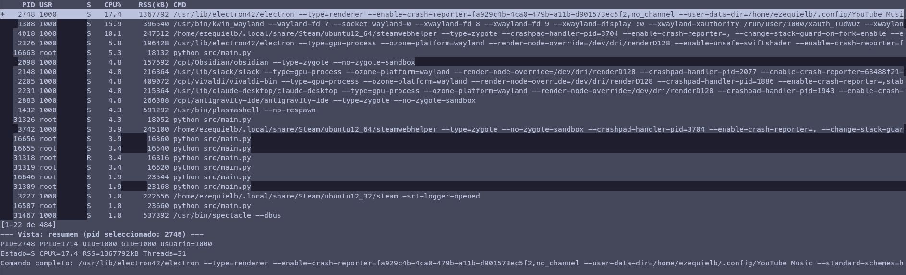
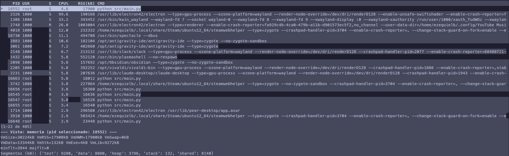
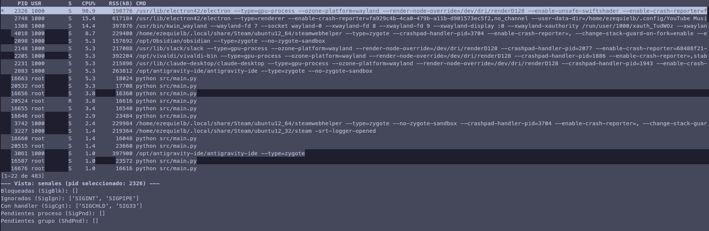
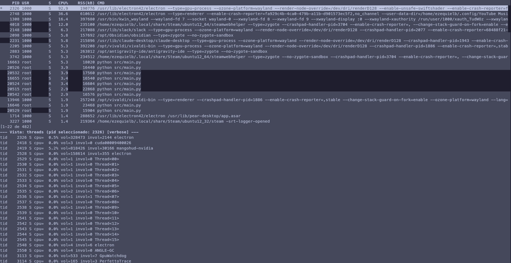

# TP1 — Monitor de Procesos y Threads

Computación II — Universidad de Mendoza — 2026

Ezequiel Blajevitch

## Estado actual

Funcionalidad obligatoria completa: Docker/estructura del repo, `procfs.py`
(parseo de `/proc`), recolector + 7 analizadores multiproceso con snapshot
compartido, manejo completo de las 5 señales (self-pipe), TUI con las 7
vistas alternables. Pendiente: pulido general, capturas de pantalla, y
extensiones opcionales (bonus).

## Descripción general

Monitor de procesos y threads de Linux, estilo `htop` pero con foco en mostrar
la anatomía interna de cada proceso (memoria, FDs, threads, señales,
scheduling), leyendo `/proc` directamente. Arquitectura multiproceso: un
recolector lista los PIDs vivos, 7 analizadores independientes extraen cada
uno una dimensión distinta en paralelo, y todos escriben a un snapshot
compartido en memoria (`Manager().dict()`). Una TUI hecha con `curses`
muestra una lista de procesos (arriba) y un panel de detalle que cambia según
la vista activa (abajo), con navegación, filtros, pin y ordenamiento.

## Diagrama de arquitectura

```
                    ┌──────────────────────────────────────┐
                    │           SNAPSHOT GLOBAL             │
                    │      (Manager().dict() compartido)    │
                    │  cada analizador escribe SU clave:     │
                    │  resumen / memoria / fds / threads /   │
                    │  senales / scheduling / sistema        │
                    └───────▲────────────────────────▲───────┘
                            │ escriben (7 procesos)   │ lee (main.py, luego TUI)
   ┌────────┐   ┌───────────┼──────┬─────────┬───────┴──────┬───────────┐
   │Recolec-│   │           │      │         │              │           │
   │tor     │   ▼           ▼      ▼         ▼              ▼           ▼
   │(1 proc)│ Resumen   Memoria  FDs     Threads       Senales    Scheduling  Sistema
   └───┬────┘  (2s)      (3s)   (5s)      (2s)          (10s)       (10s)     (2s)
       │
       ▼
  pids_compartidos (Manager().list())
  leído por los 7 analizadores en cada vuelta de su loop
```

Cada analizador es un `Process` independiente (no un thread) con su propio
intervalo, guardado en un `multiprocessing.Value` para poder ajustarlo en
runtime (pensado para cuando la TUI implemente `+`/`-`).

## Capturas de pantalla

**Vista Resumen** — lista de procesos con CPU%/RSS reales del sistema:



**Vista Memoria** — segmentos, faults y VmRSS/VmSize del proceso pineado:



**Vista Señales** — máscaras decodificadas (`SigBlk`, `SigIgn`, `SigCgt`...):



**Modo verbose** (`SIGUSR2`, o la tecla `v`) — vista Threads mostrando todas
las entradas en vez de recortar a 12:



## Decisiones de diseño

### `pid: "host"` en `docker-compose.yml`

El contenedor comparte el namespace de PID con el sistema anfitrión. `/proc`
no es un filesystem que se monta por copia, sino una vista generada por el
kernel *según el namespace de PID del proceso que lo lee*. Sin esta opción,
el monitor solo vería los procesos internos del propio contenedor (2-3),
en vez de los procesos reales de la máquina.

Lo verifiqué: con `pid: host`, `main.py` reportó 504 procesos
visibles en `/proc` al correr `docker compose up --build`, muy por encima de
lo que tendría un contenedor aislado.

### `Manager().dict()` / `Manager().list()` para el estado compartido, no `Value`/`Array`

`Value` y `Array` de `multiprocessing` solo sirven para tipos C simples de
tamaño fijo (un `double`, un array de `int`) porque están respaldados
directamente por memoria compartida (`mmap`). Nuestro snapshot es una
estructura arbitraria y variable (`dict` de `dict`s de `dict`s/`list`s), así
que no entra en ese molde. `Manager()` en cambio levanta un proceso servidor
aparte que mantiene el objeto real; lo que recibe cada analizador es un
*proxy* que se ve como un dict/list normal pero por debajo hace llamadas al
servidor. Es más lento que `Value`/`Array`, pero es la única opción de la
librería estándar para datos con forma arbitraria.

Donde sí usamos `Value`: el intervalo de refresco de cada analizador es un
solo `double` — ahí `Value("d", ...)` es exactamente el caso de uso correcto,
y más liviano que meterlo en el `Manager`.

### Por qué no usamos `Queue` ni `Pipe`

Nuestra comunicación es de tipo **"muchos escritores, muchos lectores" sobre
estado compartido** (cada analizador escribe su clave del snapshot; la TUI
lee cualquier clave en cualquier momento) — no es un pipeline
productor-consumidor de mensajes secuenciales, que es el caso de uso natural
de `Queue`/`Pipe` (un mensaje se saca de la cola y desaparece para los demás
lectores). Para nuestro problema, necesitábamos que el *último* valor de
cada clave quedara disponible para quien lo pida, no una cola de eventos
consumibles una sola vez — por eso `Manager().dict()` encaja mejor que
`Queue`. La única cola de trabajo real que tenemos (`pids_compartidos`,
el recolector "produce" la lista y los analizadores la "consumen") también
se resolvió con `Manager().list()` en vez de `Queue`, porque cada analizador
necesita **releer la lista completa en cada vuelta** (no consumir un ítem y
que desaparezca) — todos necesitan ver los mismos PIDs al mismo tiempo.

### Cómo evitamos race conditions sin usar `Lock` explícito

Cada analizador escribe **una sola clave propia** del `snapshot` (por ejemplo,
`resumen.py` solo toca `snapshot["resumen"]`). Como ningún otro proceso
escribe esa misma clave, no hay dos escritores compitiendo por el mismo dato
— el particionamiento por clave es la estrategia de sincronización en sí
misma, no hace falta un `Lock` manual encima. `Manager().dict()` además ya
serializa internamente cada operación individual (`__setitem__`), así que una
escritura de clave nunca queda a medio hacer.

Donde sí hay una fuente potencial de race condition real: el recolector
reemplaza `pids_compartidos[:] = listar_pids()` mientras los 7 analizadores
podrían estar iterando esa misma lista al mismo tiempo. La mitigamos
copiando con `list(pids_compartidos)` al principio de cada vuelta del loop
de cada analizador, antes de iterar — así cada analizador trabaja sobre una
"foto" estable de esa vuelta, en vez de iterar directo sobre un proxy que
otro proceso puede estar mutando.

### Bug real encontrado: herencia de handlers de señal en `fork()`

Al testear `Ctrl+C`, los procesos hijos (recolector y analizadores)
explotaban con su propio `KeyboardInterrupt` en vez de dejar que el proceso
principal coordinara el shutdown. La causa: `multiprocessing` en Linux usa
`fork()` por default, y el hijo hereda el handler de señal que tenía el
padre **en el momento exacto del fork**. Yo instalaba mi handler de SIGINT en
el padre *después* de `p.start()`, así que los hijos se forkeaban con el
handler default de Python (que lanza `KeyboardInterrupt`).

Fix: cada función de analizador llama
`signal.signal(signal.SIGINT, signal.SIG_IGN)` como primera línea, ignorando
la señal explícitamente. Así, sin importar cómo se propague la señal, **solo
el proceso principal reacciona** y decide el shutdown, cerrando a los hijos
ordenadamente con `terminate()` + `join()`.

### Señales completas: patrón self-pipe (`senales.py`)

Un signal handler real corre en un contexto muy restringido: casi ninguna
función de Python (ni siquiera `print()` o tocar un dict) es segura de
llamar ahí. La solución (self-pipe, Clase 6): el handler hace **una sola
cosa async-signal-safe**, escribir un byte a un pipe (`os.write`). El loop
principal, afuera del contexto de señal, espera con `select()` sobre ese
pipe y recién ahí hace el trabajo real: decidir shutdown (SIGINT/SIGTERM),
recargar `config.json` (SIGHUP), volcar el snapshot a
`dump_<timestamp>.json` (SIGUSR1), o togglear modo verbose (SIGUSR2).

`ManejadorSenales` (proceso principal) instala un handler para las 5
señales. `ignorar_senales_en_hijo()` (recolector + 7 analizadores) ignora
SIGINT/SIGHUP/SIGUSR1/SIGUSR2 — esas señales solo tienen sentido para quien
orquesta, no para cada hijo individualmente.

**Segundo bug real, más sutil, encontrado al testear**: al principio hice
que los hijos ignoraran **también** SIGTERM, con el mismo argumento ("solo
el padre decide"). Pero `Process.terminate()` de `multiprocessing`
funciona mandándole SIGTERM **directo y puntual** a ese proceso — no es una
señal de "grupo" como SIGINT. Al ignorarla en el hijo, `terminate()` dejaba
de tener efecto: el hijo quedaba vivo para siempre después del "shutdown".
Lo verifiqué con `ps --ppid` después de mandar SIGINT al proceso principal:
los hijos seguían listados como vivos. Fix: SIGTERM se saca de la lista de
señales que el hijo ignora, dejando la acción default (terminar), que es
exactamente lo que `terminate()` necesita para funcionar.

### TUI con `curses`, no `rich`

Elegí `curses` (stdlib, cero dependencias) en vez de `rich` porque su modelo
de `getch()` con timeout (`stdscr.nodelay(True)` + `stdscr.timeout(200)`)
resuelve entrada de teclado y redibujado periódico **en un solo loop**, sin
necesitar un thread aparte para leer stdin. `rich` es visualmente más prolijo
pero para eso hay que armar el polling de teclado a mano con un thread —
tiempo que no tenía de sobra.

Ese mismo loop, en cada vuelta, primero revisa señales pendientes del
self-pipe con `manejador.esperar(timeout=0)` (no bloqueante — la TUI no
puede darse el lujo de esperar), después lee una tecla, y por último
redibuja. Todo en el proceso principal, sin threads.

`curses.wrapper()` envuelve `correr_tui` para garantizar que la terminal se
restaure a su estado normal **incluso si el código de adentro tira una
excepción** — importante, porque `curses` deja la terminal en modo raw y sin
eco; sin este wrapper, un crash dejaría la terminal del usuario inutilizable
hasta cerrar la sesión.

**Diseño de estado**: `EstadoTUI` (en `display.py`) guarda vista activa,
selección, pin, filtros y orden — separado a propósito de las funciones de
render y de curses, así `lista_procesos()` (filtro + orden + pin) se puede
testear con un snapshot falso sin necesitar una terminal real. Lo hice así
porque probar código de `curses` de punta a punta requiere una tty de verdad
(usé `script` para simularlo en un contenedor, pero no reemplaza una prueba
interactiva real).

**Bug encontrado en esta fase**: al matar el grupo de procesos entero de
golpe en una prueba (`timeout` + `script`), el proceso servidor del
`Manager` murió antes que nuestro propio self-pipe procesara el shutdown, y
la siguiente lectura del snapshot (`snapshot.get(...)`) explotó con
`ConnectionResetError` — traceback crudo, terminal en mal estado. Se
soluciona envolviendo el cuerpo del loop en un `try/except` que trata
`ConnectionResetError`/`BrokenPipeError`/`EOFError`/`OSError` como señal de
"hay que cerrar", en vez de dejar que se propague.

### Por qué estos intervalos por defecto

Los valores (`resumen`/`sistema`/`threads` cada 2s, `memoria` 3s, `fds` 5s,
`senales`/`scheduling` 10s) son los que pide la consigna, elegidos ahí en
función de qué tan caro es de leer cada dato y qué tan rápido cambia:
`fd` implica un `readlink` por cada file descriptor abierto (potencialmente
caro con muchos FDs), y señales/scheduling cambian con mucha menos
frecuencia que el estado de CPU o memoria de un proceso.

## Conceptos del curso aplicados

- **Namespaces de PID** (Clase 3/4, fork y jerarquía de procesos): por qué
  `/proc` dentro de un contenedor normalmente solo muestra un puñado de
  procesos, y por qué `pid: host` lo resuelve.
- **Jiffies y `HZ` del scheduler** (Clase 3): el CPU% de cada proceso se
  calcula con el delta de `utime + stime` (campos 14-15 de `/proc/<pid>/stat`)
  entre dos lecturas, convertido a segundos con `os.sysconf("SC_CLK_TCK")` —
  no asumimos que un jiffie sea "1/100 de segundo" fijo.
- **`fork()` y herencia de estado del proceso** (Clase 4): la razón exacta
  del bug de SIGINT descripto arriba — el hijo es una copia de la memoria del
  padre en el instante del fork, incluyendo la tabla de disposición de
  señales.
- **Máscaras de señales como bitmask de 64 bits** (Clase 6): `SigBlk`,
  `SigIgn`, `SigCgt` de `/proc/<pid>/status` son hex de 64 bits donde el bit
  `n-1` representa la señal POSIX número `n`. Decodificado con
  `mascara & (1 << (n - 1))` en `decodificar_mascara_senales()`.
- **Multiprocessing: `Process`, `Manager`, `Value`** (Clase 8-9): toda la
  arquitectura del recolector + analizadores + snapshot está construida
  sobre estas tres primitivas, con el criterio de elección justificado
  arriba.
- **Threads como LWPs en `/proc/<pid>/task`** (Clase 10): la vista Threads
  lista cada entrada de `task/` como un LWP independiente con su propio
  `stat` (estado, CPU%) y `status` (context switches), tal cual se ve en el
  sistema real con `ps -eLf`.

## Limitaciones conocidas

- **SIGWINCH** (repintar al redimensionar la terminal) no está implementado
  — es opcional según la consigna. `curses` recorta el contenido si la
  ventana es más chica que lo que se quiere dibujar, pero no reacciona a un
  resize en vivo.
- Procesos de otros usuarios (o del propio contenedor sin privilegios)
  generan `PermissionError` al leer su `/status`/`/maps`/`/fd` — se
  descartan silenciosamente en vez de mostrarse con datos parciales.
- El modo verbose (SIGUSR2) hoy solo afecta las vistas de FDs y Threads
  (muestra todas las entradas en vez de recortar a 12) — el ejemplo textual
  de la consigna. El resto de las vistas ya muestran toda su info siempre,
  así que no había nada que "destapar" con verbose.
- Solo se puede pinear **un** proceso a la vez (`estado.pid_pineado` es un
  solo valor, no una lista) — cumple lo que pide la consigna en singular.
  Pinear varios a la vez se parece al bonus "comparativa cross-proceso"
  (no implementado).
- `docker compose up` (sin `-d`, un solo servicio) puede mostrar la salida
  de `curses` mezclada con el prefijo de log de Compose (`monitor-1  |`) y
  no reenviar el teclado de forma confiable — es una limitación del modo
  "attached" de Compose para procesos de pantalla completa, no de nuestro
  código. Para probar la TUI interactivamente, usar
  `docker compose run --rm monitor` (ver más abajo).

### Bugs encontrados en la prueba manual interactiva (y sus fixes)

Probar con teclado real (no solo con `script` simulando una terminal) hizo
aparecer dos bugs reales que las pruebas automatizadas no detectaban:

1. **Pin/unpin roto tras navegar**: `estado.seleccion` era un índice de fila
   sobre una lista que se reordena en vivo (CPU%/RSS cambian cada segundo).
   Al pinear, el proceso saltaba a la fila 0 en el próximo frame, pero
   `seleccion` quedaba con el valor viejo — un segundo `Enter` (pensado para
   despinear) terminaba pineando OTRO proceso, el que casualmente quedó en
   esa fila. Fix en `_togglear_pin()`: si ya hay algo pineado, `Enter`
   **siempre** lo despinea, sin mirar `seleccion` para nada.
2. **Selección invisible al bajar de la fila 10**: la lista dibujaba siempre
   `procesos[:10]` fijo; bajar más allá de esa fila seguía incrementando
   `estado.seleccion` pero esas filas nunca se llegaban a dibujar, así que
   el highlight "desaparecía" sin ningún error. Fix: `filas_visibles()`
   calcula una ventana de scroll que sigue a la selección (estilo
   `less`/`htop`), y la altura de la lista ahora es dinámica según el alto
   real de la terminal en vez de un `10` fijo.

Con esto arreglado, validé a mano — flechas, `Enter` (pin/unpin con
navegación de por medio), `/` y `u` (filtros), `c` (orden), `+`/`-`
(intervalos), `h`/`?` (ayuda), `q` (salir) — sin encontrar nada más.

## Cómo correr y testear

```bash
cd tp1
docker compose up --build
```

Este es el comando pedido por la consigna: construye la imagen y levanta el
contenedor. **Para usar la TUI de forma interactiva de verdad**, la manera
confiable es:

```bash
docker compose run --rm monitor
```

`run` conecta la terminal directo al contenedor (stdin/stdout/tty reales),
sin el wrapper de streaming de logs que usa `up` en foreground. Navegá con
las teclas de la tabla de arriba (`1-7`/`r,m,f,t,s,p,g` para cambiar de
vista, flechas para moverte por la lista, `h`/`?` para ayuda, `q` para
salir). `q` o `Ctrl+C` disparan un shutdown ordenado de los 8 procesos
(recolector + 7 analizadores).

**Extra sobre modo verbose**: además de mandar `SIGUSR2` desde afuera
(`docker kill --signal=USR2 <contenedor>`), la tecla `v` dentro de la TUI
hace que el proceso se mande la señal a sí mismo
(`os.kill(os.getpid(), signal.SIGUSR2)`) — pasa por el mismo self-pipe y el
mismo handler real, es solo una comodidad para no necesitar una segunda
terminal.

**Nota honesta sobre `docker compose up --build`**: probamos a fondo (ver
`dudas.md`) por qué este comando, sin `-d`, no permite interactuar bien con
la TUI — Compose multiplexa la salida con un prefijo de log por línea
(`monitor-1  |`) y no reenvía el teclado de forma confiable al contenedor.
Esto es una limitación conocida de `docker compose up` en modo foreground
para programas de pantalla completa como `curses`, no un bug de nuestra
arquitectura — lo verificamos también con `docker attach` y con
`COMPOSE_MENU=0`. `run` es la vía que usamos para validar toda la
interacción de teclado.

### Probar las señales

Con el contenedor corriendo (en otra terminal, `docker compose up -d`):

```bash
CID=$(docker compose ps -q monitor)
docker kill --signal=HUP  $CID   # recarga config.json
docker kill --signal=USR1 $CID   # dump_<timestamp>.json
docker kill --signal=USR2 $CID   # toggle verbose
docker kill --signal=INT  $CID   # shutdown limpio (o TERM, hacen lo mismo)
docker compose logs monitor      # ver qué reaccionó a cada una
```

## Lo que aprendiste

En sistemas operativos vimos htop, procesos e hilos y me alegra haber podido
manejarlos y haber creado mi propio "htop". No sabía que acceder a toda la
información de los procesos fuese tan simple, pensaba que era más difícil —
está todo ahí en texto plano en `/proc`, sin necesitar privilegios
especiales.

Lo que más me costó entender de la parte teórica fue por qué cada proceso
tiene su propia memoria aislada, y que por eso un `dict` normal de Python no
sirve para compartir datos entre el recolector y los analizadores — hace
falta algo como `Manager`, que en realidad es un proceso servidor aparte al
que todos le mandan mensajes. También me costó entender las máscaras de
señales (`SigBlk`, `SigIgn`), pero una vez que entendí que cada bit
representa una señal distinta, tuvo sentido.

En algunos casos lo que más me costó fue testear las cosas, pero con la IA
como profe me ayudó a resolver cualquier duda y/o problema que tuve.

Lo que más me sorprendió de todo este trabajo es que lo que realmente me
costó fue intentar hacer que `docker compose up` hiciese andar el programa
bien, y es más, no lo pude lograr — tuve que usar `docker compose run
monitor` para que ande jaja.

Esas son mis reflexiones sobre este trabajo, profe.
